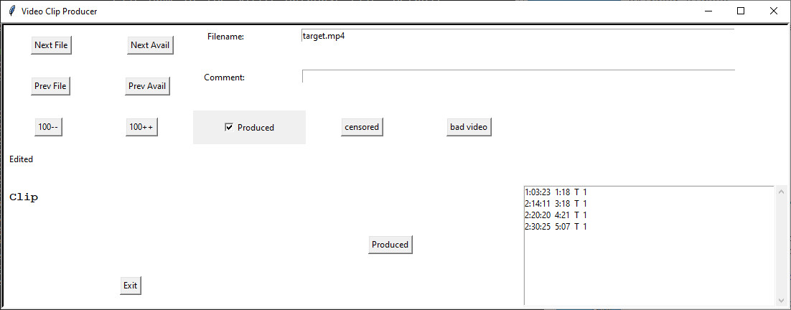

Various programs related to video editing and producing.

.. contents::

========
Overview
========

This is a collection of tools I use to manage the 100s of videos. I
use CyberLink PowerDirector to actually do the video editing. I use
the tools here to manage the clips.

video_clip.py - used in conjunction with PowerDirector to mark each
clip in a video. A clip has a start time, duration, activity and
optional magnification. I don't use the last field anymore. This
Python program collects that data for each clip and stores it into an
SQlite database.

video_clip_producer.py - used after running video_clip.py to:

  - retain just the clips, by removing the non-interesting parts,
  - perhaps removing the audio track,
  - saving the result using your video editor,
  - generating MPG file using your video editor, and
  - marking this video as produced.

stats.py - displays the unique categories in the first column, sorted,
followed by these columns:

  - the total time for clips with that category
  - the number of clips
  - the time for the shortest clip
  - the time for the longest clip
  - the average time for clips
  - the standard deviation
  - the variance

video_length.py - computes the length of one or more videos.

============
Dependencies
============

Create a virtual environment::

  python -m venv vtools-env
  source vtools-env/bin/activate
  pip install pip -U # Latest pip
  pip install -r requirements.txt

If running on windows, you may need to run this command before
activating::

  dos2unix vtools-env/Scripts/activate

That will fix the line terminations.

I use the following tools, which are assumed to be installed:

 - CyberLink PowerDirector video editor. Buy it here:
     https://www.cyberlink.com/. actually any video editor will work. 
 - ffprobe - download from here: https://ffmpeg.org/download.html
 - DB Browser for SQlite - download from here: https://sqlitebrowser.org/dl/

If you want to view the README in a browser-like window, enter this in a
terminal window::

   restview README.rst

This will start a simple web server to display markdown. Next bring up
a browser and enter this URL: http://localhost:8009/README.md

==========
First Step
==========

First capture or create videos of interest. Store them on
your hard drive.

-------------
video_clip.py
-------------

This program is used to collect detail on clips in videos and store
that in the database. Use this in conjunction with a video editor like
PowerDirector to make clips. The clip details are entered by hand.

On startup this program detects new videos that are not in the
database. Next it will:

  1. display up to 20 filenames of videos that can be processed,
  2. display the filename of the current video to be processed,
  3. Put that filename in the cut/paste buffer. I use that to open the
     video and save the project in PowerDirector.
  4. Display the 'Comment: ' prompt.
  
At this prompt, one of several things can be entered:
  1. a string that starts with e or q (exit or quit). This causes the
     program to stop.
  2. the string 'skip' (without quotes). This causes processing of
     the current video to be skipped and processing on the next video
     to start. Nothing is written to the database. 
  3. a string that starts with a digit. This is the start time for the
     first clip of the video. Note that at this point the
     auto_fill_time variable it set to '0:'. If '0' is entered, the
     start_time becomes 0:00:00. If SS:FF (seconds and frames are
     digits (leading insignificant '0's can be omitted) is
     entered, the auto_fill_time is prepended setting start_time to
     '0:SS:FF'. A new auto_fill_file is calculated after every clip is
     proccesed by adding start_time and duration, truncating the seconds
     and frames part.
  4. If none of the above match the string becomes the comment field
     in the database for this video. This normally is an empty
     string.

If a comment was entered, the following are done:
  1. The length of the video in HH:MM:SS:FF format is displayed.
  2. The name of the video is diaplayed and a loop starts iterating,
     once for each clip.
  3. The 'Start_time' prompt displays which shows the clip number
     (starts with 1) and the auto_time_fill. Several things happen
     depending on what is entered:

       1. If the Enter key is pressed this signifies the end of
          this video and processing begins on the next video.
       2. For the first iteration, if the start time was entered for
          the comment prompt, it skips to step 4. Otherwise, keyboard
          input is expected.  If the start time is entered as SS:FF,
          the auto_time_fill is prepended to form a complete
          HH:MM:SS:FF start time. This is intended to save time whcn
          several clips in the video are on the same minute.
       3. If none of those cases match the start_time is entered as
          HH:MM:SS:FF format. Again, non-significant leading digits
          can be omitted.
  4. After entering the start_time, the following are displayed:
         1. The default duration is displayed by calculating the
            difference between the video length and the start time. This
            is useful when the last clip ends at the end of the video. 
            This is recalculatede for every clip.
         2. The 'duration (HH:MM:SS:FF): ' prompt is dosplayed. If the
            Enter key is pressed then the default duration is
            used. Otherwise the duration should entered in HH:MM:SS:FF. If
            HH:MM: is 00:00 then it can be omitted. If only SS:FF is
            entered, leading 0's can be omitted.
  5. Next comes the activity. This is used an indicator of the
     general content of a clip. If you have videos of a cars, this might be the
     make of the car in a clip. Another clip in the same video showing
     a different car might have a different 'activity'. When starting
     this program you can pass an argument for the default
     activity. At the 'activity (FORD,?)' prompt you can press the
     Enter key to take the default or press the question mark key (?)
     to see a list of the current activities. Instead of entering a
     full activity, you can enter just a much as is needed to match
     the first few characters. If one match is found it displays the
     activity that matched.
  6. The final field is the magnification. I started using this and
     then stopped. It should probably be removed.
  7. Go back to step 3 to continue the iteration to enter a start time
     for the next clip.

Sometimes the video_clip.py program skips videos. I haven't determined
why. If that happens, just run the program again to pick up the
skipped videos.

Here is a sample of the output::

    $ ./video_clip.py
    ('cars.mp4', 4071)
    4071
    Editing: cars.mp4
    Comment: 1:22
    time_remaining='22:16'
    start_time clip 1 (0:): 1:22
    duration (20:24):
    activity (FORD,?):
    mag (1):
    start_time clip 2 (0:):
    4071
    Error: file cars.mp4 already edited.

The number 4071 is the id of the video in the videos table.
Note that only the start time and duration were entered.
The defaults were taken for the other fields.

----------------------
video_clip_producer.py
----------------------

This program is used to produce an MPG file from the clips, storing
them in a directory who name matches the clips activity column.

======
Schema
======

The following are the definitions of the 2 tables used: clips and videos::

    CREATE TABLE IF NOT EXISTS "clips" (
	"id"	INTEGER,
	"video_id"	INTEGER,
	"start_time"	VARCHAR(10),
	"duration"	VARCHAR(10),
	"activity"	CHAR(1),
	"mag"	TEXT,
	"duration_seconds"	REAL,
	"start_frame"	INTEGER,
	PRIMARY KEY("id" AUTOINCREMENT),
	FOREIGN KEY("video_id") REFERENCES "videos"("id")
    );

    CREATE TABLE IF NOT EXISTS "videos" (
	"id"	INTEGER,
	"filename"	varchar(200),
	"comment"	VARCHAR(50),
	"edited"	integer,
	"produced"	INTEGER DEFAULT 0,
	"created_date"	TEXT,
	"produced_date"	TEXT,
	"md5"	TEXT,
	"category"	TEXT,
	"ford_rank"	INTEGER,
	"gm_rank"	INTEGER,
	"other_rank"	INTEGER,
	"mpg_order"	NUMERIC,
	"is_other"	int DEFAULT 0,
	PRIMARY KEY("id" AUTOINCREMENT)
    );

In the clips table, the duration_seconds and start_frame columns
are computed by tools defined here from the duration and start_time
fields, respectively.

In the videos table, the md5 field is computed as an MD5 hash by a
tool defined here, using the content of the filename. This can be used
to detect duplicate videos.

The category column contains one or more activities preceed and
followed by a plus (+) sign. Consider a database for clips containing
car manufactures. A video that contains clips of Ford and GM cars
would have a category of +ford+gm+.

The videos table has "rank" columns that use the category field to
rank the subjective 'goodness' of a produced video. Rank values might
be the following:

   1. Bad
   2. Good
   3. Great

The rank values are enterd by you. The idea is to use a SELECT
statement to pull out categories of clips with a certain rank. For
example a SELECT statement like the following::

    SELECT filename FROM videos WHERE category like "%+ford+%"
    AND ford_rank = 5
    ORDER BY 1

would select videos that contain great ford cars.

The "is" columns(s) are used to filter videos that do not have a category.

